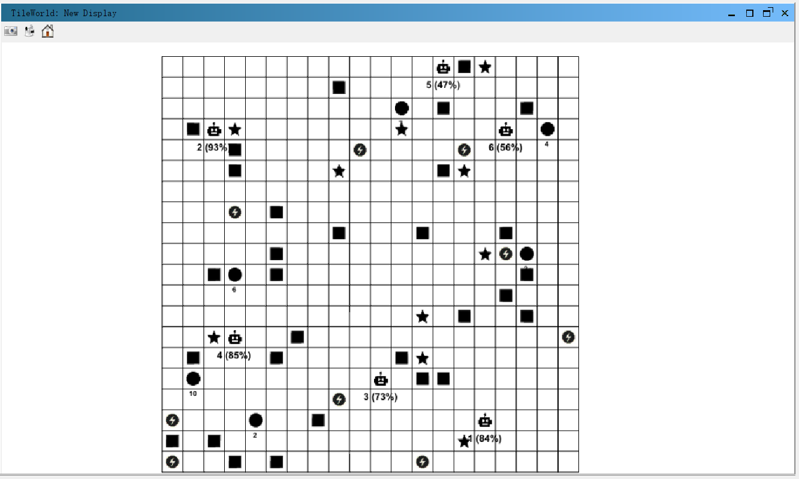
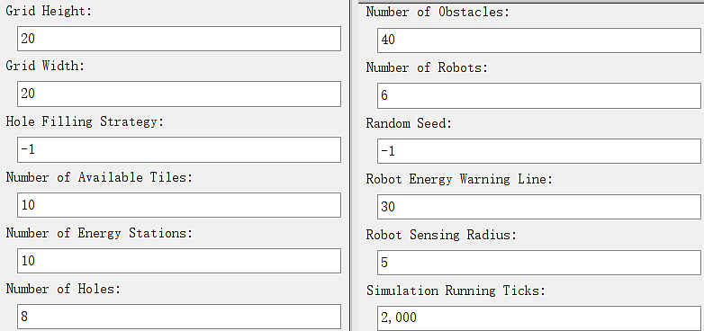
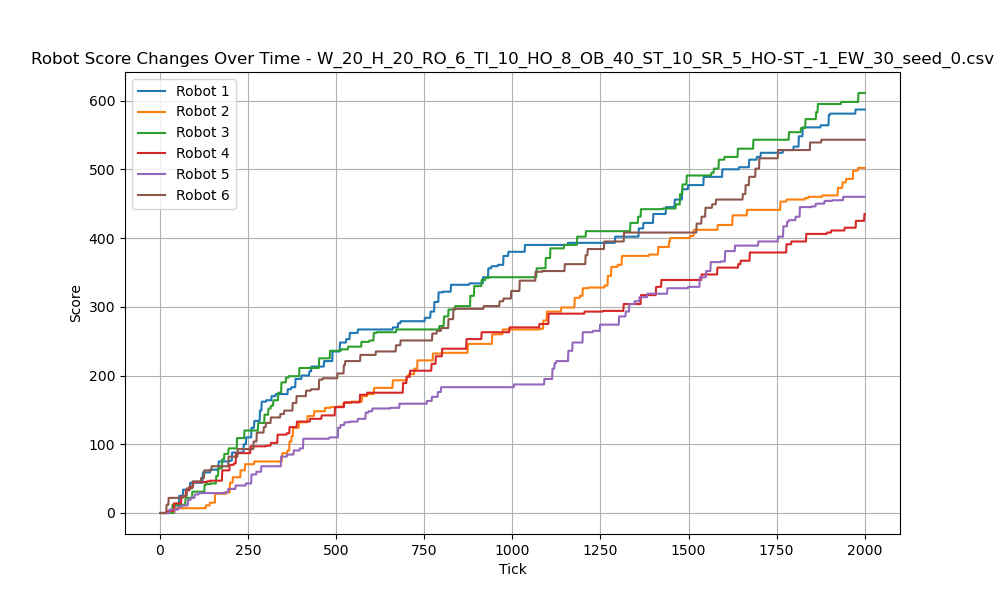
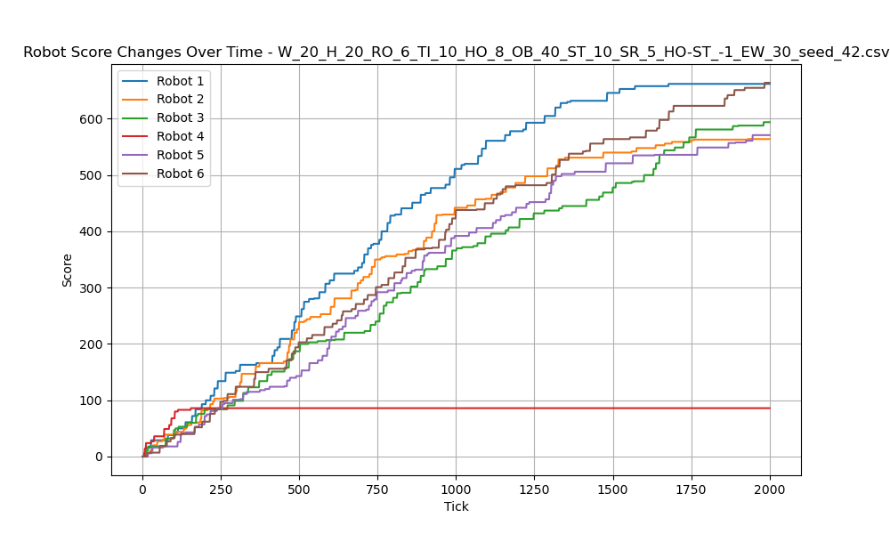
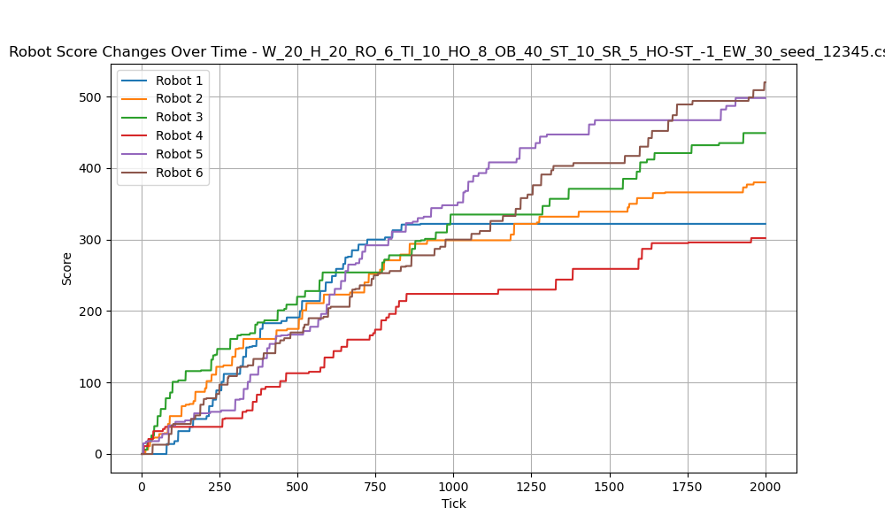
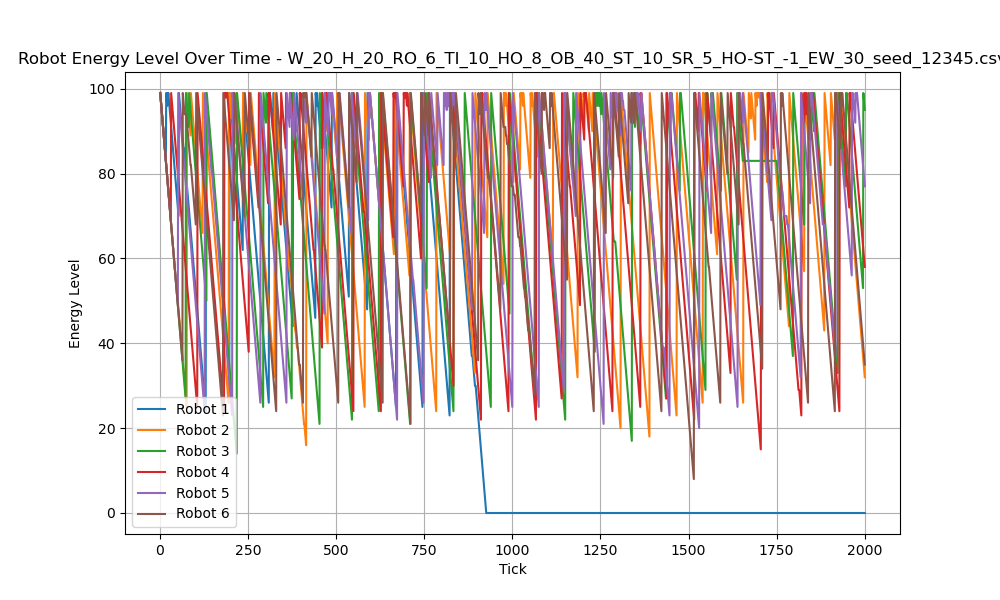

# ADVANCED MULTI-AGENT SYSTEMS ASSIGNMENT REPORT


**Assignment ID:** 1

**Student Name:** Chunhui XU 徐春晖

**Student ID:** GTM12110304


## DESIGN

### Legend

#### Icon Legend


#### World Example



### Brief Introduction to Get Start

#### Overview

In this assignment, I will develop a multi-agent system to simulate a dynamic 2D *Tileworld* environment.

The simulation has a robot agent that is responsible for sensing and filling holes in the world, and each hole is assigned a specific reward score. Their goal is for these robots to maximize their score by filling holes.

#### Robot Agents

 The robots have some challenges, such as low energy, random obstacles, and the dynamic changing of environment.

And this agent will follow the Belief Desire Intention (BDI) paradigm, which means that they have beliefs about the environment, desires to achieve certain goals (such as filling holes), and intentions that guide their actions.

For example, the robots believe that tiles and holes exist in certain locations, and they want to fill as many holes as possible to get higher score. Their intentions are guided by these beliefs and desires.

I will introduce the specific operation of BDI later.

#### World Element

There are different elements:

- **Robot**: Agent, need to fill the hole and get score.
- **Tile**: Can be pick up to fill a hole.
- **Hole**: Wait to be filled.
- **Obstacle**: Block robot path.
- **Energy Station**: Charge the robot to full energy.


#### Simulation Goal

The robot's role involves walking around, collecting tiles, and filling holes to get score. they must take care of their energy to avoid running out of energy before reaching the energy station.

The robot needs to maintain the sensing result of its surroundings, make decisions based on the current state of the world, and adjust actions to achieve the set goals.

I will explain how to perform specific steps of the simulation. For example, I will show my implement for the agent and environment and how to optimize the robot's performance using different strategies.

Finally, I will base this simulation on *[Repast Simphony](https://repast.github.io/)*.

### Class Design

#### File Structure

```text
└─tileworld
    ├─agent
    │      Robot.groovy # Robot Agent 
    |      HoleStrategy.groovy # Hole filling strategy enum
    │
    ├─common
    │      GridTrait.groovy # Grid Base Class
    │
    ├─context
    │      TileWorldBuilder.groovy # Build the context
    │      WorldManager.groovy # Manage world's dynamic part, singleton
    │
    ├─data
    │      DataHandler.groovy # Collect the data to save
    │      RobotData.groovy # Data POJO
    │
    ├─environment # Environment Elements
    │      EnergyStation.groovy
    │      Hole.groovy
    │      Obstacle.groovy
    │      Tile.groovy
    │
    └─utils # singleton
            GridUtils.groovy # Some public Grid utils
            ParameterUtils.groovy # Parameter Singleton
            StationPlacer.groovy # Calculate Energy Station Location
```

In this implementation, I chose to use [*Groovy language*](https://groovy-lang.org/) .

The *Repast Simphony* project natively supports Groovy and Java. Groovy is also a JVM language that follows the object-oriented design paradigm. Groovy is very similar to Java and can be seamlessly integrated with it. It can also omit some complex syntax in Java development, and supports some advanced features, such as type inference, etc. These advantages make it very suitable for simulation of small projects.

My overall design makes the whole system clear. It is easy to add or modify functions to the system, and it is relatively easy to maintain in the future.

This is a good object-oriented *Repast Simphony* model system design.

#### Common Trait

I noticed that these classes shared a number of traits, so I created a Groovy trait `GridTrait` that abstracted some of their common traits for them to implement.

```groovy
@CompileStatic
trait GridTrait {
    Grid grid
    GridPoint location

    void changeLocPlaceTo(GridPoint destination) {
        location = destination
        place()
    }

    void place() {
        grid.moveTo(this, location.x, location.y)
    }

    int calcPath(GridPoint other) {
        Math.abs(location.x - other.x) + Math.abs(location.y - other.y)
    }

    // ...
}
```

These contents are the basis for building these classes.

#### Personal Structure

Then I add different attributes to them relatively, so they can have their own functions.

- `Tile`
  - `claimed` : whether it has been claimed.
- `Hole`
  - `claimed` : whether it has been claimed.
- `Obstacle`
  - none
- `EnergyStation`
  - none

- `Robot` have more attributes
    - `id` : A unique identifier for each robot instance.
    - `energy` : The robot's energy level.
    - `scoreEarned` : Record the score the robot has accumulated.
    - `stepFromLastHole` : The number of steps the robot has taken since it last filled a hole.  It is used for A* algorithm.
    - `haveTile` :  Whether the robot is carrying a tile.
    - `SENSING_RADIUS` : Robot sense object's range.
    - `ENERGY_WARNING` : Energy threshold value. When the energy is lower than it, robot will imediately finding an energy station to recharge.
    - `tileClaimed` : The tile the robot has claimed.
    - `holeClaimed` : The hole the robot has claimed.
    - `nearestStation` : Points to the nearest energy station. The robot will attempt to move towards it when its energy is low.


### BDI Paradigm

There's an outline of how the BDI paradigm would work for my `Robot` agent:

#### Beliefs

- **Energy Level**: `energy` – The agent knows its energy.
- **Location**: `location` – The agent knows its current position on the grid.
- **Tile Claimed**: `tileClaimed` – The agent knows its claimed tile .
- **Hole Claimed**: `holeClaimed` – The agent knows its claimed hole.
- **Energy Station**: `nearestStation` – The agent knows the nearest station.

#### Desires

- **Claim Tile**: If the agent is not carrying a tile, it desires to claim a unclaimed tile.
- **Pick a Tile**: If the agent is not carrying a tile, it desires to move to its claimed tile.
- **Claim a Hole**: If the agent already has a tile, it desires to claim a unclaimed hole.
- **Deposit Tile into Hole**: If the agent has a tile and a hole is available, it desires to move to its claimed hole.
- **Recharge Energy**: If the agent's energy becomes low, it desires to move towards the nearest energy station.
- **Move to Random Location**: If no other targets are available it desires to move randomly to explore the grid or avoid getting stuck.

These desires decides it intentions next.

#### Intentions (Priority from high to low)

- **Recharge at Energy Station**: If the agent's energy becomes low, it will move towards the nearest energy station to recharge.
- **Pick a Tile**: If the agent is not carrying a tile, the agent will claim nearest one, move towards it and pick it up.
- **Deposit Tile into Hole**: If the agent has a tile and at least one hole is unclaimed, the agent will claim best one, move towards it and put the tile.
- **Move to Random Location**: Random move.

### Hole Filling Strategy

#### `HIGHTEST`

Directly search for the hole with the highest score to fill.

#### `NEAREST`

Directly search for the nearest hole to fill.

#### `A_STAR`

Use A* algorithm

$$
f (x) = g(x) + h(x)
$$

Where $g(x)$ is the distance traveled since the last hole filling, and $h(x)$ is the estimated straight-line distance of the current object $x$.

In this way, the existing distance and past costs will be combined to make a local optimal strategy.

### Pathfinding Strategy

My robot calculates the direction to move by comparing its current position to the target's position.

First, the algorithm will calculate the direction to target location horizontally and vertically, which is `dx` and `dy` . $x_d, y_d \in \{-1, 0, 1\}$

Second, the robot will try to move the through direction. But if its energy is 0, it will do nothing and return.

Third, since it only move one step each, it will decide the final direction and move, but there will be obstacles along the road, so:

- If movement in one direction is blocked, it will randomly try another valid move in another direction (even though the calculated direction difference may be 0), which will help it pass the obstacle.
- If both horizontal and vertical targets are blocked, it will try to move in the opposite direction to get out of the situation where it is blocked.

I try my best to avoid the blocked situation and let the robot find a way out, then:

Before executing a move, it checks if the target location is blocked. If the target location is blocked, the move is not executed, and the robot remains in its current position.

Finally, if the move is valid, the robot’s location is updated to the new position.

### Data Record

I design a POJO to record the data.

```groovy
@TupleConstructor
@CompileStatic
class RobotData {
    double tick
    String id
    int score
    int energy
    GridPoint location
    GridPoint target
}
```


When the simulation is over, the `DataHandler` will collect the data, then output as `.csv` using `opencsv` .

### Energy Station Distribution Algorithm

Force-based layout optimization algorithm. Make the energy stations random and dispersed as much as possible. Because this part is not the focus of our homework, I let the AI tool DeepSeek-R1 assist me in completing this part of the algorithm.

## RUNNING RESULT

### Parameter Setting



The world's changing interval is $100$.

### Running Result

In the test, Robot strategy vs. id

- `A_STAR` :  1 & 4
- `HIGHEST` : 2 & 5
- `NEAREST` : 3 & 6

#### Score

##### Seed 0



##### Seed 42



##### Seed 12345



As can be seen from the iamge, the `A_STAR` strategy is not very good. It may be that it is constrained by too many factors to consider and often falls into local optimality, and ignores the fact that this is an environment with some gaming with other robot.

On the contrary, the effect of the `NEAREST` strategy is better, probably because in this case, the robot will claim its holes as much as possible, so that it can use the advantage of quantity of holes to make up for the score quality, and finally achieve the best effect.

But it is worth noting that in my design, there is no strong competition between robots. When filling holes, they still maintain the method of claim first and then filling, and there is no obvious competition.

#### Energy

##### Seed 12345



From the above figure, we can see that when the energy warning threshold is set to 30, the minimum energy value of robots will reach about 18-24. Conservatively estimated, under the energy station density I set, the robot needs about 10 more steps to reach the nearest energy station.

However, there are also some unexpected extreme situations that cause the robot to lose energy to zero and can not move to anywhere anymore.

## PROBLEMS

### Initialize vs. Restart

Some variables may behave normally the first time they are initialized, but may behave abnormally the second time when I use Repast restart action.

Then I found that when context restarts, the entire JVM process will not be restarted, but it will be rerun selectively, and some singleton objects I set must also have corresponding refresh methods.

The `RunEnvironment` instance is initialized only once within a single GUI run, but the context will rebuild every time.

### *Repast Simphony* Setting

Changing simulation configuration in GUI is inconvenient, unclear, and generates many redundant files.

**Solution**: After becoming familiar with the important parameters and operating principles required for *Repast* configuration, I manually change the necessary information in the relevant `.xml` files. This way is accurate and helps me to deepen the understanding of *Repast* system construction.

### *Repast Simphony* Using

In JVM language development, I prefer [*IntelliJ IDEA*](https://www.jetbrains.com/idea/) for medium or large projects, and [*Visual Studio Code*](https://code.visualstudio.com/) for lightweight projects.

How ever, *Repast Simphony* based on [*Eclipse*](https://www.eclipse.org/) , and add many personalized modules and functions, which means it's very hard to migrate to another IDE or editor.

So I learn to use Eclipse plugins and configurations to improve it to a development environment that I was used to.
