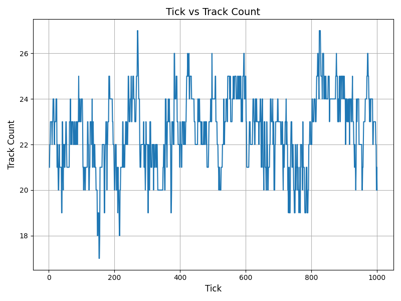
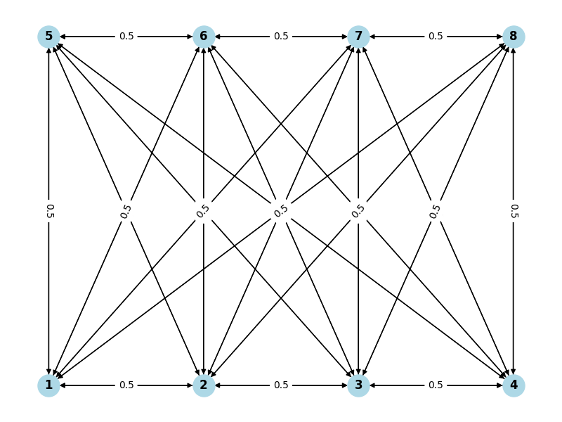
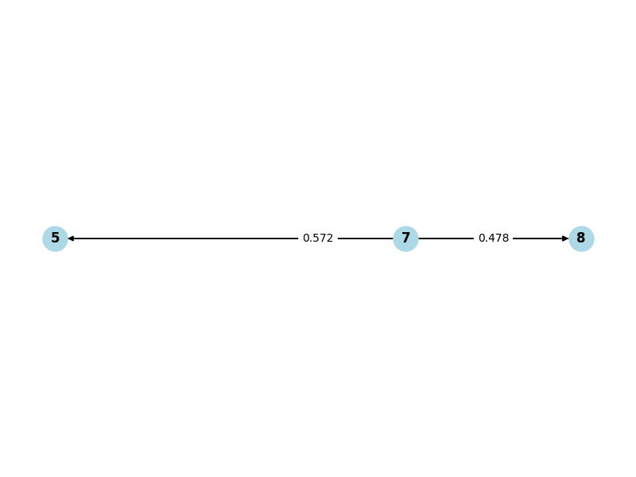

# ADVANCED MULTI-AGENT SYSTEMS ASSIGNMENT REPORT


**Assignment ID:** 2

**Student Name:** Chunhui XU 徐春晖

**Student ID:** GTM12110304


## DESIGN

### Legend

#### Icon Legend


#### World Example


### Brief Introduction to Get Start


#### Simulation Goal

In this task, I will simulate a camera group and complete the target tracking and transfer algorithm.

In the transfer algorithm, I will use the ant colony algorithm to save the neighboring pheromones to more effectively select good neighbors and reduce the cost of communication.

After the communication is established, I will also use auctions to achieve the transfer of tracking targets.

### Class Design

#### File Structure

```text
└─camera
    ├─agent
    │      Camera.groovy # Hole Agent
    │      CameraParam.groovy # Camera parameter POJO (for Scenario initialization)
    │
    ├─common
    │      BidRec.groovy # Bid communication model class
    │      SpaceTrait.groovy # Space item base class
    │
    ├─context
    │      CameraScenario.groovy # Scenario Preset
    │      MultiCameraTrackingBuilder.groovy # Build the context
    │      WorldManager.groovy # Manage world's item, singleton
    │
    ├─data
    │      DataHandler.groovy # Collect the data to save
    │
    ├─environment # Environment elements
    │      Target.groovy # Target object class
    │
    ├─graph # for vision graph
    │      PheGraph.groovy # graph main class
    │      PStrategy.groovy # Probability Strategy enumerate class
    │
    ├─style
    │      CameraStyle.groovy
    │
    └─utils # singleton
            ParameterUtils.groovy # Parameter singleton
            SpaceUtils.groovy # Some public Space item utils
```

The overall design follows good object-oriented paradigms, making it as easy as possible to follow the open-closed principle.

#### Common Trait

I created a Groovy trait `SpaceTrait` that abstracted some of `Camera` and `Target` common traits for them to implement. These contents are the basis for building them.

```groovy
@CompileStatic
trait SpaceTrait {
    ContinuousSpace space
    int id

    boolean moveTo(double x, double y) {
        space.moveTo(this, x, y)
    }

    // Calculate (x difference, y difference, distance) with others (for FOV calculation)
    double[] calcDxDyDistanceWithOther(SpaceTrait other) {
        NdPoint thisLoc = space.getLocation(this)
        NdPoint otherLoc = space.getLocation(other)
        return SpaceUtils.calcDxDyDistance(thisLoc, otherLoc)
    }
}
```

#### Personal Structure

Then I add different attributes to them relatively, so they can have their own functions.

- `Target`
  - `trackedBy` : tracked by which camera, `-1` for no one
- `Camera`
  - `RADIUS` : camera track radius
  - `ANGLE` : camera track angle
  - `ROTATION` : camera track rotation
  - `MAX_TRACK` : max targets track number
  - `ownedTargets` : owned targets list

## REPORT FOR REQUIREMENTS

In this section, because it involves a lot of specific code implementation, I will add comments as detailed as possible to achieve the purpose of explaining the code functions.

Please refer to my code comments to understand my implementation.

### Requirement 1

I design a `CameraScenario` class to record the camera preset configuration. For example, for Scenario 2 from A2 instructions:

```groovy
// CameraScenario.groovy 

private static void init1() {
    // Create scenario with world size (x size, y size)
    CameraScenario scenario = new CameraScenario(40, 30)
    def cp = scenario.cameraParams

    // Camera parameters: location x, location y, rotation angle
    cp << new CameraParam(5, 2, 90)
    cp << new CameraParam(15, 2, 90)
    cp << new CameraParam(25, 2, 90)
    cp << new CameraParam(35, 2, 90)
    cp << new CameraParam(5, 28, -90)
    cp << new CameraParam(15, 28, -90)
    cp << new CameraParam(25, 28, -90)
    cp << new CameraParam(35, 28, -90)

    // Add this scenario preset to preset list
    scenarios << scenario
}
```

So I can simulate the scenario. The result is shown in the picture in the Example at the beginning of the report.

To determine whether it is within the camera fov, I use the method:

```groovy
// Camera.groovy 

/**
 * Judge whether the target is in this camera FOV.
 * 
 * @param target Input target object
 * @return boolean value whether the target is in FOV
 */
private boolean isInFOV(Target target) {
    // Get (x difference, y difference, distance) from other util methods
    def res = calcDxDyDistanceWithOther(target)

    // Get value for FOV calculation
    double dx = -res[0]
    double dy = -res[1]
    double distance = res[2]

    // Outside radius
    if (distance > RADIUS) {
        return false
    }

    // Calculate the absolute angle of an object (-180, 180)
    double angle = Math.toDegrees(Math.atan2(dy, dx))

    // Get relative angle
    double relativeAngle = ROTATION - angle

    // Determine whether it is within the angle range
    return Math.abs(relativeAngle) <= ANGLE / 2
}
```

### Requirement 2

For two different $P(i,x)$ decision strategies, I designed an enumeration class `PStrategy`  to represent two different implementations. For both implementations, I wrote corresponding codes.

```groovy
// PheGraph.groovy

/**
 * Method to get neighbor's notify probability for specific camera
 * 
 * @param fromId From which camera
 * @return A Integer -> Double map, indicate neighbor's id —> notify probability
 */
Map<Integer, Double> getNotifyProbabilities(int fromId) {
    // Get all it's neighbors as a list
    def neighbors = pheromoneMap[fromId]

    // Initialize the result map
    Map<Integer, Double> probabilities = [:].withDefault{ 0.0 }

    // Select strategy
    switch(pStrategy) {
        case PStrategy.SMOOTH:
        // SMOOTH strategy
        // Max neighbors' pheromone value im
            double im = pheromoneMap[fromId].values().max() as double

            if (im == 0) {
                // No available neighbor, broadcast
                neighbors.each{ id, phe ->
                    // All probabilities are 1
                    probabilities[id] = 1d
                }
            } else {
                neighbors.each{ id, phe ->
                    // Use Eq. 4 from paper
                    probabilities[id] = (1d + phe) / (1d + im)
                }
            }
            break
        case PStrategy.STEP:
        // STEP strategy
            neighbors.each{ id, phe ->
                // Use Eq. 5 from paper
                probabilities[id] = (phe > EPS ? 1d : ETA)
            }
    }

    return probabilities
}
```

In the actual simulation, I chose the STEP method because it is simpler and more direct.

For this approach, the expected effect is:

When the pheromone level of an edge is greater than a given $\epsilon $ value, the camera will always notify its neighbor to participate in the auction; otherwise, it will notify the neighbor to participate with a smaller probability $\eta $.

This implementation ensures that stronger neighbors can always stay in touch, while weaker neighbors will not always have no chance to communicate.

### Requirement 3

For confidence $c$ , I couldn't think of a proper way to quantize a continuous value, so I simply set it to $1$ if it's in the FOV, and $0$ otherwise.

For visibility $v$ , I took into account the angle and distance factors.

- Angle factor $f_a$ : relative angle difference $\alpha $ , camera angle $\theta $ , difference factor $r = \frac{\alpha}{theta}$ ,  final factor $f_a = \frac{1}{1+r} - 0.5$
- Distance factor $f_d$ : relative distance difference $x$ , camera radius $R$ ,  difference factor $r = \frac{x}{R}$ ,  final factor $f_d = 1 - r$

Then,  $v= f_af_d$ , code as below :

```groovy
// Camera.groovy

/**
 * Calculates the utility of an object if tracked by this camera.
 * 
 * NOTE: This is for calculating the bid for a specific object.
 * 
 * @param target the object to be tracked
 * @return one single double value representing the utility
 */
double getTargetUtility(Target target) {
    // Similar steps like FOV calculation
    def res = calcDxDyDistanceWithOther(target)
    double dx = -res[0]
    double dy = -res[1]
    double distance = res[2]
    double angle = Math.toDegrees(Math.atan2(dy, dx))
    double relativeAngle = ROTATION - angle

    // Calculate angle factor
    double factor = Math.abs(relativeAngle) / (ANGLE / 2)
    double angleVis = 1 / (1 + factor) - 0.5
    // Calculate radius factor
    double radiusVis = 1.0 - (distance / RADIUS)
    // Get v
    double visibility = angleVis * radiusVis

    // Calculate confidence
    double confidence = isInFOV(target) ? 1.0 : 0.0

    return confidence * visibility
}
```

### Requirement 4

Since Repast Simphony has strong internal encapsulation, there are many multi-threading related issues, which I am not sure I can solve well. So in the implementation of the auction process, I use blocking communication.

But I try to optimize the code structure to make it easy to expand for asynchronous communication.

The relevant code is shown below

#### Bid Record class

```groovy
// BidRec.groovy

/**
 * Bid record POJO
 */
@CompileStatic
class BidRec {
    int bidderId
    int auctioneerId
    int targetId
    double bid

    BidRec(int bidderId, int auctioneerId, int targetId, double bid) {
        this.bidderId = bidderId
        this.auctioneerId = auctioneerId
        this.targetId = targetId
        this.bid = bid
    }

    @Override
    String toString() {
        return "Bid ${bid} for target ${targetId}, from bidder ${bidderId} to ${auctioneerId}";
    }
}
```

#### Camera Auctioneer Hand Over Main Method

```groovy
// Camera.groovy

/**
 * Hand over method using Vickrey Auction
 * 
 * @param target target need to hand over
 * @return Boolean value, whether hand over success
 */
private boolean handOver(Target target) {
    recivedBid[target] = []
    int targetId = target.id

    // advertise owned objects to other cameras
    // Get probabilities from vision graph
    def neiProbabilities = graph.getNotifyProbabilities(id)

    // For each neighbor
    neiProbabilities.each { camId, probability ->
        if (probability >= 1 || RandomHelper.nextDouble() > probability) {
            // Send the neighbor, call its receive method for simulation
            sendTo(camId).receiveAuction(this.id, targetId)
        }
    }

    // receive bids (i.e., utility) from other cameras
    def bids = recivedBid[target]

    // No response
    if (bids.isEmpty()) {
        return false
    }

    // Sort the bid
    def sortedBids = bids.sort { -it.bid }

    // Decide the winner
    def winnerBid = sortedBids.first()

    // Decide the final bid
    double finalBid = 0.0
    // Have second bidder
    if (sortedBids.size() >= 2) {
        finalBid = sortedBids[1].bid
    }

    // decide the winner and finalize transfer of object
    // update the current utility of the buyer & seller cameras
    double thisUtility = ownedUtilities[target]
    // Can't hand over for utility is not enough
    if (thisUtility > 0 && finalBid <= thisUtility) {
        return false
    }

    // Get winner ID
    def winnerId = winnerBid.bidderId

    // Auctioneer sent
    sendTransferedTarget(target, finalBid)
    // Winner receive
    sendTo(winnerId).receiveTransferedTarget(target, finalBid)

    // update vision graph for success trade
    graph.reinforce(this.id, winnerId)

    return true
}


```

#### Communication Methods

```groovy
// Camera.groovy

/**     
 * Calculates own bid for specific target from .
 * 
 * @param auctioneer Auctioneer who send the request
 * @param target The target object
 */
void receiveAuction(int auctioneerId, int targetId) {
    // Get the utility
    double bid = getTargetUtility(world.getTargetById(targetId))
    // Judge if can handle the new one
    if (ownedTargets.size() < MAX_TRACK && bid > 0) {
        // Create record
        def bidRec = new BidRec(id, auctioneerId, targetId, bid)
        // Send record
        sendTo(auctioneerId).receiveBid(bidRec)
    }
}

/**
 * Receives and processes a bid record.
 * 
 * @param bidRec The bid record containing auctioneer ID, bid amount, and target ID.
 */
void receiveBid(BidRec bidRec) {
    // Wrong
    if (bidRec.auctioneerId != this.id) return
        // Invalid
        if (bidRec.bid <= 0) return

        // Have target
        def target = recivedBid.keySet().find { it.id == bidRec.targetId }
    // Collect bid record
    if (target) {
        recivedBid[target] << bidRec
    }
}

/**
 * Winner bidder receive the target object
 * 
 * @param target Received target
 * @param bid final bid
 */
void receiveTransferedTarget(Target target, double bid) {
    // Add to owned
    ownedTargets << target
    // Track the camera
    target.trackByCamera(id)
    // Payment increase
    payment += bid
}

/**
 * Auctioneer send the target object
 * 
 * @param target Sent target
 * @param bid Auctioneer
 */
private void sendTransferedTarget(Target target, double bid) {
    // Lose the target track
    target.loseTrackBy(id)
    // Received payment increase
    pReceive += bid
}

/**
 * For simulate communication
 *
 * @param cameraId send to camera's id
 * @return the camera object reference
 */
private Camera sendTo(int cameraId) {
    world.getCameraById(cameraId)
}
```

### Requirement 5

I use a separate `PheGraph` class to manage the global pheromone information and is responsible for calculating the notification probability $P(i,x)$.

Such unified management also facilitates data collection.

```groovy
// PheGraph.groovy

// Map for pheromone
private final Map<Integer, Map<Integer, Double>> pheromoneMap = [:].withDefault {
    [:].withDefault {
        0.5
    }
}

// Map for last trade infomation
private final Map<Integer, Map<Integer, Boolean>> tradeMap = [:].withDefault {
    [:].withDefault {
        false
    }
}

// Other field

/**
 * Initial for new step
 */
void initThisStep() {
    // Clear the trade record map
    (1..dim).each { i ->
        tradeMap.put(i, [:])
        (1..dim).each{ j ->
            if (i != j) {
                tradeMap[i][j] = false
            }
        }
    }
}

/**
 * Evaporate based on last step infomation
 */
void evaporateLastStep() {
    // For each element
    pheromoneMap.each { from, neighbors ->
        neighbors.each { to, value ->
            // Last time have trade?
            boolean tradeOccurred = tradeMap[from][to]
            // Determine the pheromone
            double newLevel = tradeOccurred ?
                    (1 - RHO) * value + DELTA :
                    (1 - RHO) * value
            // Update the value
            neighbors[to] = newLevel
        }
    }
}

/**
 * Last time trade record
 * 
 * @param fromId from auctioneer
 * @param toId to bidder winner
 */
void reinforce(int fromId, int toId) {
    // Record the trade info
    tradeMap[fromId][toId] = true
}
```

Instantiate it as a member variable of the `WorldManager` class and call the corresponding method in each step.

```groovy
// WorldManager.groovy

/***
 * Handles pheromone levels of edges in the vision graph.
 */
@ScheduledMethod(start = 2d, interval = 1d)
void handlePheromone() {
    // evaporate pheromone
    visionGraph.evaporateLastStep()
    visionGraph.initThisStep()
}
```

For the parameters:

- $\rho = 0.1$ : Control the evaporation rate to prevent pheromones from disappearing too quickly.
- $\Delta = 1$ : Make updates more noticeable when trade occur.

### Requirement 6

Since I tend to keep existing tracks longer, I only track new one if there is camera capacity left after the auction process is over.

```groovy
// Camera.groovy

/**
 * Simulate the behavior of object tracking
 */
private void trackObjects() {
    // with limited resources, sometimes I can only track some objects
    int spare = MAX_TRACK - ownedTargets.size()

    // if no spare
    if (spare == 0) return

        int newCount = 0
    // Get targets
    def newTargets = getAvailableTargets()
    // Sort by there utility
    newTargets.sort{ -getTargetUtility(it) }

    // While loop
    int newTargetI = 0
    while(spare > newCount && newTargetI < newTargets.size()) {
        // Get the target
        def target = newTargets[newTargetI]
        // Double check not tracked by other camera
        if (!target.isTracked) {
            // Track it
            target.trackByCamera(id)
            // Add target to owned
            ownedTargets << target
            ++newCount
        }
        ++newTargetI
    }
}
```

### Requirement 7, 8 are in Next Section

## RUNNING RESULT

### Parameter Setting Example


### Requirement 7

As can be seen from the figure, my simulation also has a good tracking effect when there are 30 targets. The results are shown in the figure.



### Requirement 8

I select graph in step 0, 300, 600, 900, and set threshold as $0.1$. As pheromones evaporate, cameras tend to trade with only a subset of their neighbors.

|  |  |
| ------------------------------------------------- | ----------------------------------------------- |
|  |  |


## PROBLEMS

### Draw a 2D camera range graphic

I found two problems when drawing the camera range:

- The classes in the referenced repast have some implicit external dependencies, which prevents me from correctly referencing these packages to draw. For example:

  > The type javax.vecmath.AxisAngle4f cannot be resolved. It is indirectly referenced from required type saf.v3d.scene.VSpatial

  The `saf.v3d.scene.VSpatial` class is used internally by repast, but I might meet mistakes if I use it myself.

- The `VSpatial` drawn by Repast 2D GUI may not overlap in some cases:

  

### Data Collect and Visualization

Compared with the last assignment, the data collection and quantification this time are more complicated and not easy to do well.

### Parameter Selection

Because there is no good quantitative standard, there is no definite and specific experimental result when running the simulations. There is no effective methodology for parameter selection, so I can only perform simple analysis.
