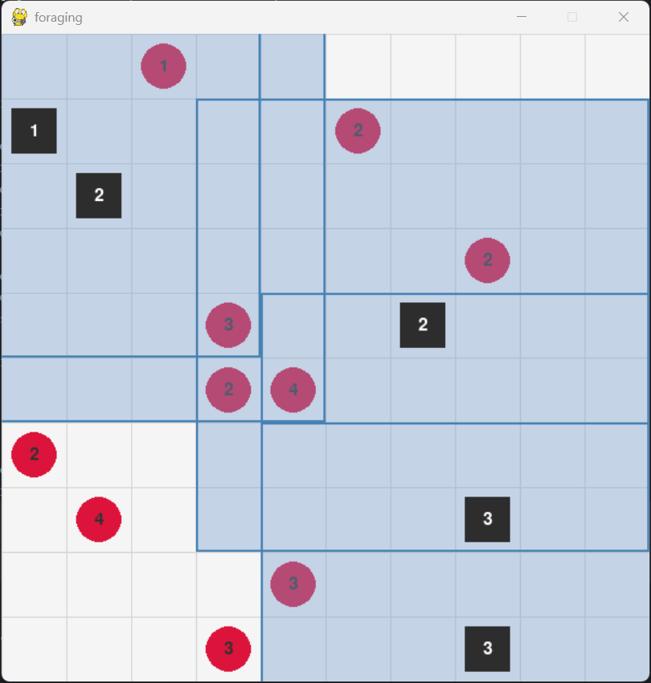

# ADVANCED MULTI-AGENT SYSTEMS ASSIGNMENT REPORT


**Assignment ID:** 3

**Student Name:** Chunhui XU 徐春晖

**Student ID:** GTM12110304


## DESIGN

### Concept Introduction

#### Overview

In this assignment, I will implement a multi-agent system using reinforcement learning, to have a experience of Multi-Agent Reinforcement Learning (MARL) algorithms.

I use [PettingZoo](https://pettingzoo.farama.org/) , which is *an API standard for multi-agent reinforcement learning* to achieve this system.

The Assignment has two parts:

- In part one, I need to implement independent Q-learning (IQL) and centralized Q-learning (CQL) in [SISL Pursuit](https://pettingzoo.farama.org/environments/sisl/pursuit/) environment.
- In part two, I need to implement my own *Level-based foraging* environment, and test either IQL or CQL in this environment.

#### Deep Q-Learning

In classical Q-learning, we need to built a Q-table to store the Q value for each state $s$ and action $a$ , but we'll face two problems:

- High-dimension: The shape of Q-table is $\text{dim}(s) \times \text{dim}(a)$. If the state or action dimension is high, the Q-table will be every large, which is difficult to calculate and store the Q values.
- Continuous state spaces: If the state is continuous, it can not convert to a discrete table.

So Deep Q-learning comes out. It use Deep Neural Network (DNN) to approximate the Q-function.

In Deep Q network, there are several components in implementation:

- Experience Replay: Agent will memorize the experiences as transitions, and sample the transitions in the replay buffer as a minibatch, to perform each step's learning.
- Target Network: Agent has policy network and target network. It will evaluate policy network several times and update the target network finally.

#### IQL

In IQL, every agent manage its own local data: state, action, transitions, DQN. And each one use these information to update its own network.

Advantages

- Easy to implement.
- Easy to scaling agent num.

Drawbacks

- Each single agent may got into local optimum.
- Each agent's independent updates may cause global learning unsmooth.

#### CQL

In centralized Q-learning, there is usually a central controller agent. It can get the joint state and joint action of all agents. It memorize all the transitions. It learns a single global Q-function that evaluates the value of taking a joint action given a joint state.

Advantages

- Easier to reach global optimum.
- Make the updates of DQN smoother.

Drawbacks

- Curse of Dimensionality: The dimension of state and action grows exponentially as the number of agents increases.
- Central agent resource overhead is high.

### Overall Code Design

Regarding the implementation of basic IQL and CQL, I followed the lab tutorial version and made some modification, so I won't go into every detail about code.

For specific code explanations, I will focus on the parts that I modify. But I still have a general explanation of the whole implementation process.

#### File Structure

```text
├─a3marl  # MARL package
│  │  __init__.py
│  │
│  ├─agents  # agent package
│  │  │  _cql.py  # cql implementation
│  │  │  _iql.py  # iql implementation
│  │  │  __init__.py
│  │  │
│  │  └─_base
│  │          _agent.py  # agnet base class
│  │          _config.py  # config base class
│  │          _memory.py  # memory entry
│  │          _network.py  # network design
│  │          __init__.py
│  │
│  ├─envs # environment package
│  │  │  __init__.py
│  │  │
│  │  ├─foraging  # level-based foraging env
│  │  │      raw_env.py  # env main design
│  │  │      _render.py  # render
│  │  │      __init__.py
│  │  │
│  │  └─utils  # env config base
│  │          _config.py
│  │          __init__.py
│  │
│  ├─trainer  # trainer util package
│  │  │  _cql.py  # CQL trainer
│  │  │  _iql.py  # IQL trainer
│  │  │  __init__.py
│  │  │
│  │  └─_utils
│  │          _train.py
│  │          __init__.py
│  │
│  └─utils  # utils package
│          _plot.py  # plot data
│          _save.py  # save data to csv
│          __init__.py
│
└─main  # main notebooks
    │  fo_iql.ipynb  # foraging IQL
    │  pu_cql.ipynb  # pursuit CQL
    │  pu_iql.ipynb  # pursuit IQL
    │
    └─data  # experiment data
        └─ final_load_plot.py  # plot script
```


#### DQN Agent

```python
class DQN(nn.Module):
    def __init__(self, n_obs: int, n_act: int, hidden_dims: list[int]) -> None:
        super(DQN, self).__init__()
        self.obs_dim: int = n_obs
        self.act_dim: int = n_act
        self.hidden_dims: list[int] = hidden_dims

        # model
        layers: list[nn.Module] = []
        input_dim = self.obs_dim

        for h_dim in self.hidden_dims:
            layers.append(nn.Linear(input_dim, h_dim))
            layers.append(nn.ReLU())
            input_dim = h_dim

        layers.append(nn.Linear(input_dim, self.act_dim))

        self.network: nn.Sequential = nn.Sequential(*layers)
        self._reset_parameters()
```

For the MLP DQN, I change integer `hidden_dim` to a list `hidden_dims` , in order to try to bring some scalability in the MLP structure.

#### Memory

```python
import numpy as np
from collections import namedtuple, deque

# state: 1 x obs_dim
# action: 1 x 1
# reward: 1 x 1
Transition = namedtuple("Transition", ("state", "action", "next_state", "reward"))


class ReplayMemory:
    def __init__(self, capacity: int = 10_000) -> None:
        self.memory: deque[Transition] = deque([], maxlen=capacity)

    def push(self, *args) -> None:
        """Save a transition"""
        self.memory.append(Transition(*args))

    def sample(self, batch_size: int) -> list[Transition]:
        if len(self.memory) < batch_size:
            raise ValueError(
                f"Not enough {len(self.memory)} samples for batch size: {batch_size}"
            )
        return np.random.choice(self.memory, size=batch_size, replace=False).tolist()

    def __len__(self) -> int:
        return len(self.memory)

```

In Memory part, I follow lab, abstract the quadruple into a `Transition` type. The type store the state, action, next_state, reward, in line with the conventions of deep Q learning.

Then, when need to sample transition from memory, the `sample()` will return a list witch size is batch size. I use `numpy` for the sample, attempting to achieve higher efficiency.

### Train Design

#### IQL Trainer

IQL Trainer have the following logic steps:

**Initialization**: The system creates an instance for each agent in the environment. Each instance maintains its own DQN.

**Observation and action decision** involves:

- At each time step, each agent uses its own policy network to independently select an action based on its observed local state.
- The actions of all agents are summarized and submitted to the environment, which returns their next state, reward, and completion signal after execution. This process could be parallel.
- Each agent stores its own transition in its own replay pool, and agents do not share their experience memory.

Then perform **independent training**: After storing the experience, each agent independently samples data from its own replay pool and uses this data to update its own policy network.

Finally, try to **evaluate and update target network**.

- Calculate the mean of all agent returns and compare it with the best historical average return (`best_mean`).
- Only when the overall performance of the current policy network is better than the historical best, the system will let all agents copy the weights of their own policy network to the target network. Such evaluation helps to enhance the stability of the update, and is necessary in MARL.

#### CQL Trainer

Some implementation logic and details of CQL are similar to those of IQL, but they differ in the following aspects:

**Central agent and network**: Unlike IQL, there is only one "central agent" instance in the system, which maintains a central DQN.

**Joint observation and action**:

- When making decisions, the central agent collects the local observations of all independent agents and integrates them into a "joint state".
- This joint state is then input into the network. The network outputs a "joint action" that contains a set of instructions for the next specific actions of all agents.
- Then these joint observation state and information will stored in the central memory poll.

The final evaluate and update steps are similar to IQL.

### Environment Design

#### Environment Configuration Interface

To create unified evaluation environment, I create a `EnvConfig` class.

```python
from dataclasses import dataclass

from pettingzoo import ParallelEnv


@dataclass
class EnvConfig:
    name_abbr: str
    env_creator: callable
    env_kwargs: dict[str, object]

    def get_env(self, **override_kwargs) -> ParallelEnv:
        if override_kwargs is not None:
            final_kwargs = self.env_kwargs.copy()
            final_kwargs.update(override_kwargs)
            return self.env_creator(**final_kwargs)
        else:
            return self.env_creator(**self.env_kwargs)
```

It has three member variables:

- `name_abbr` : It gives the environment a name.
- `env_creator` : Callable function to create the environment.
- `env_kwargs` : A dictionary to create the

To create a *pettingzoo* environment, just call `get_env` function of the `EnvConfig` instance.

### Foraging Environment Design

#### Overview

This is a level-based foraging MARL environment. This is a 2D world, have forager and crops. Each one have a level value. The core idea is let the muti-forager agents cooperate to harvest all the crops.

The rule of harvesting is

- Agents can try to harvest crops on adjacent grids.
- When the sum of the skill levels of all agents trying to harvest a crop is greater than or equal to the level of the crop, the harvest is successful and the crop is removed. The adjacent agents can get reward.



#### Action Space

The action space of each collector agent is discrete.

When I define the action space, I use `gymnasium.spaces.Discrete(5)`, it means that each agent can choose one of the following 5 actions at each time step:

- 0: Stay - Stay at the current position.
- 1: Move Up - Move to $(x−1,y)$ .
- 2: Move Down - Move to $(x+1,y)$ .
- 3: Move Left - Move to $(x,y−1)$ .
- 4: Move Right - Move to $(x,y+1)$ .

About the harvest action:

Different from the explanation in the lab class,  there is no explicit "harvest" action. Harvest is a passive result. When the agent moves next to the crop, at the end of each `step` , the environment automatically checks whether all crops meet the conditions for being harvested.

#### Observation Space

Each agent receives a local observation.

The observation is defined by the `obs_radius` parameter, which determines the size of the area around the agent that can be seen. It is a square area with a side length of `2 * obs_radius + 1` (can call it $d_o$ ) and centered at the agent.

The observation information is a 3D array with a shape of $(2, d_o, d_o)$ and contains two channels:

- Entity type channel: records the entity type in the local view range.

  - `AGENT_TYPE (1)` : The current agent itself.

  - `OTHER_AGENT_TYPE (2)` : Other collector agents.

  - `CROP_TYPE (3)`: Uncollected crops.

  - `PADDING_TYPE (-1)`: If the local field of view exceeds the map boundary, it is filled with this value.

  - `0` : Empty land.
- Entity level channel: records the level of the entity on each grid within the local field of view.

  - If it is an agent, it is its skill level.
  - If it is a crop, it is its crop level.
  - If it is a filled area or an empty space, the level is usually also represented by `PADDING_TYPE (-1)` or `0`.

#### Reward Function

In this environment, I design two reward functions. I will describe this functions.

##### Common Time Penalty

At each time step, as long as the harvest progress is not over, all active agents receive a small negative reward of $-0.1$ . This encourages agents to complete the task as quickly as possible.

##### Common Mission Completion Reward

When all crops are successfully harvested, all agents will receive a large positive reward of $+10$ , indicating that the mission is successfully completed.

##### Crop Harvest Reward 0

- Successfully collecting a crop will generate a fixed total team reward, in my implement is $6.0$ .
- This total reward is also distributed based on the skill level ratio of the participating intelligent agents (local rewards). For example, if agents A (level $2$) and B (level $1$) jointly harvest a crop (level $\leq 3$) with a total reward of $6.0$ , then A will receive $6.0 \times \frac{2}{2+1} = 4.0$ , B will receive  $6.0 \times \frac{1}{2+1} = 2.0$

##### Crop Harvest Reward 1

Harvest reward related to crop level, allocated based on contribution+global small rewards.

If the crop level is $l_c$ ,

- Successfully collecting a crop generates a total team reward of $2.0 \times l_c$ .
- This total reward is also distributed based on the skill level ratio of the participating intelligent agents (local rewards), same as Crop harvest Reward 1.
- In addition, as long as a crop is successfully harvested, all currently active agents (regardless of whether they participated in the collection of a specific crop) will receive an additional small global reward of $+0.5$ .

#### Step Logic

I will describe the code logic of the `step` function.

When an agent agent performs an action action, the action is recorded in `_actions_this_turn` . Until all agents have completed this round of actions, the action decision of agents will store in the list. Then, when `_agent_selector.is_last()` is `True` , we can perform the rest operations.

- Give all active agents a time penalty.
- Call `_move_all_agents()` to update agent positions according to their actions.
  - Traverse all crops that have not been removed: Check all adjacent grids of each crop.
  - Count the agents on the adjacent grids and the sum of their skill levels.
  - If the sum of skill levels $\geq$ the crop level, the crop is marked as removed.
  - Count the rewards and record them.
- If all crops are harvested, then the terminations of all agents are set to True and a task completion reward is given


## RUNNING RESULT

### Screenshot

#### Pursuit IQL


As can be seen from the figure, the curve has an increasing trend in the learning of IQL, which means that as DQN is updated, a better Q-function is obtained than the initial state.

#### Pursuit CQL


Similarly, under CQL, the return value also tends to rise.

Compared with IQL training, CQL training is faster (only one central DQN network needs to be maintained). And because CQL is easier to find the global optimal value than IQL, the curve of CQL is relatively smoother than that of IQL.

However, due to the problem of the explosion of the output action dimension, the application scope of CQL is relatively limited.

#### Foraging Reward Type 0


#### Foraging Reward Type 1


It can be seen that under the two different reward functions, IQL learning increases the return value.

The average return value of Type 1 is higher, which may be related to the small reward given to all agents after each harvest. In this way, on average, the overall reward value of Type 1 will be higher.

### Parameter Setup

#### Agent Training Parameters

| **Parameter**                                   | **Value**         |
| :---------------------------------------------- | ----------------- |
| **Overall**                                     |                   |
| `batch_size`                                    | `128`             |
| `lr` (Learning Rate)                            | `1e-3`            |
| `gamma` (Discount Factor)                       | `0.95`            |
| `grad_clip_value` (Gradient Clipping)           | `5`               |
| `mem_size` (Replay Memory Size)                 | `10,000`          |
| `dqn_update_freq` (Target Network Update Freq.) | `DQN_UPDATE_FREQ` |
| **Exploration Strategy (ε-greedy)**             |                   |
| `eps_start` (Initial Epsilon)                   | `0.9`             |
| `eps_decay` (Epsilon Decay)                     | `0.95`            |
| `eps_min` (Minimum Epsilon)                     | `0.05`            |

#### Network Structure

| **Parameter**                | **Value**       |
| :--------------------------- | --------------- |
| **IQL Network Architecture** |                 |
| `hidden_dims`                | `[100, 50, 25]` |
| **CQL Network Architecture** |                 |
| `hidden_dims`                | `[2000, 5000]`  |
| `input_dim`                  | `obs_dim * n`   |
| `output_dim`                 | `act_dim ** n`  |

## PROBLEMS

### CQL Dimension

In my implement of Pursuit, I follow the code from lab tutorial.

When I increase the number of pursuers, the output dimension occurred exponential explosion: if there are $n$ pursuers, the output dimension is $5^n$ , even if $n=8$ by default, the $5^8$ output dim is still difficult for a MLP to inference.

So I changed the configuration, reducing the number of pursuers to $6$, but at the same time changed the size the map from the default $16 \times 16$ to $12 \times 12$, to give the pursuers a better chance of catching the evaders.

